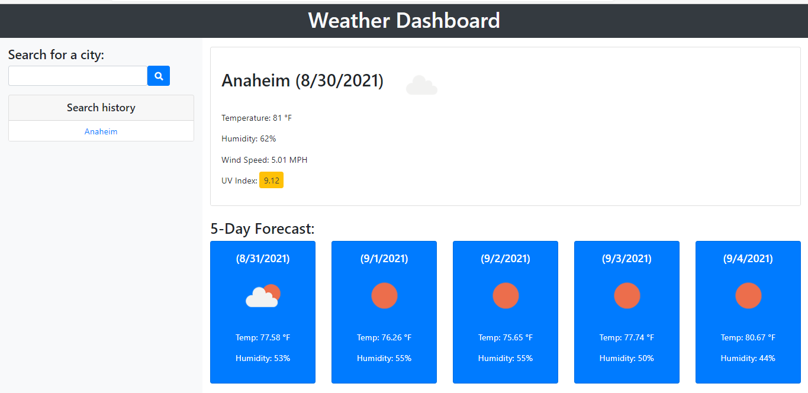

# Weather Dashboard

A dashboard that displays the weather for a searched city.

The dashboard features:

- an overview of the current weather
- a colour-coded UV index [(Based on the Wikipedia Ultraviolet Index)](https://en.wikipedia.org/wiki/Ultraviolet_index#Index_usage)
- a future, five-day weather forecast

When a valid city name is entered, the name is saved as part of a search history list and can be clicked on again to access the same data. The last search is saved to local storage so that it can be displayed when the page is reloaded.

A user story and acceptance criteria were provided, but no starter code was given.

:link: [Weather Dashboard Website](https://angelicamapeso.github.io/bootcamp-weather-dashboard/)

## Purpose

Based on the given user story, this dashboard is meant for travelers who want to plan ahead for the upcoming weather in different cities.

## Resources

### API(s)

- [Open Weather API](https://openweathermap.org/api)

### CSS Framework

- [Bootstrap 4](https://getbootstrap.com/)

### Icons

- [Font Awesome 5](https://fontawesome.com/)
